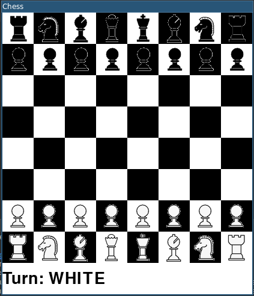

# Chess in Python

Implements a chess game in python with two player support (players move pieces alternatively). 
It has no build-in AI functionality (Open for collaboration). 
It allows only valid moves and ensures that player does not move into a check.
Its indicates if the is a check, checkmate or stalemate.
It does not implement the concept of a draw.
It supports history functionality (can undo and redo moves).

Image assets are downloaded from [open game art](https://opengameart.org/).
GUI is build using `pygame`.




## STEP
Needs python 3.7 or above installed.
Install dependencies using 
```commandline
pip install -r requirements.txt
```

Run the game using 
```commandline
python main.py
```

## HOW TO PLAY
Select a piece by clicking on it (can only select pieces belonging to current player). 
Select a new square to move the piece to (game prevents invalid and not allowed moves).
Allows squares are highlighted to aid the user.
Current players turn, checks, checkmate, or stalemate is indicated in the below the game.
Use the arrows keys (←, →) to undo and redo moves.


## CODE INFORMATION
The implementation is broken into packages.

The `board` package contains `Board` class which maintains the square to piece mapping and vice-versa.

The `pieces` package contains classes for each of the piece types extending `Piece` class. 
Each of the pieces implement `possible_moves` and `attack_squares` methods, 
which indicate valid squares a piece can move to and attack/threaten enemy pieces.

The `utils` package contains utility classes for `History`, `Memoize`, `Player`, `Square` and `Move` related functionality.

The `chess` package contains `Chess` class which is the main class which aggregates 
the all the other functionality to provide abstract chess functionality.